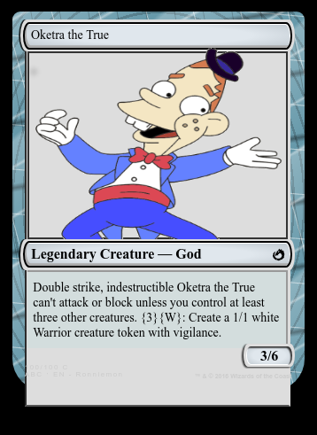

# Chalice Demo
Chalice Card Generator
## Features
Generate custom Magic: The Gathering cards from user-provided image and query of the ScryFall API (http://api.scryfall.com). Uses mtg-card-html (https://github.com/ronniemon/mtg-card-html) for the card template.

### Status Endpoint GET
`/card`

Returns a dictionary containing a status message, a card JSON url, and an image url
#### Demo URL
* https://hvjvdt31kd.execute-api.us-east-2.amazonaws.com/dev/card

### Card Generator Endpoint POST
`/card/<key>`

Searches the ScryFall API for a card with the name `<key>`. Saves the base64-encoded image provided in the raw payload to a static location. Writes to a static JSON file with card data and image location.
#### Demo URL
* https://hvjvdt31kd.execute-api.us-east-2.amazonaws.com/dev/card/monkey

### Card Renderer
`/custom-cards/Card_Template.html`

Renders a custom version of the mtg-card-html template. Loads static JSON file containing card data and image location.
#### Demo URL
* https://s3.us-east-2.amazonaws.com/custom-cards/Card_Template.html
